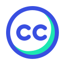

#### _Marc Albert Seguí Olmos_
## **Tarea 2 MarkDown: Documental Aaron Swartz**
---
### **1. ¿Quién es Aaron Swartz?**
#### Aaron Hillel Swartz nació en 8 de noviembre de 1986 en los Estados Unidos de America. Desde pequeño siempre tuvo cierta afición por las matematicas y los ordenadores y llegó a ser un prodigio de la programación desde corta edad.

---

### **2. ¿En qué tecnologías, proyectos, software desarrollo o colaboro Aaron Swartz?**
#### Aaron Swartz era un programador, activista y escritor de internet que fundo varias empresas importantes de hoy en dia como es [reddit](https://www.reddit.com/) o [Open Library](https://openlibrary.org/), a parte de que creó su propio lenguaje de marcas llamado [MarkDown](https://markdown.es/), un pluguin que es muy comodo de usar desde github o wordpress para gestores de contenido.

 .png "MarkDown")

---

### **3. ¿Qué son las licencias Creative Commons y en qué se diferencia de otras licencias como GNU GPL, MIT License o Apache License?**

#### Las licencias Creative Common o [CC](https://creativecommons.org/) son unos documentos legales que nacen para compartir y reutilizar diversas obras bajo unas condiciones. Aunque la obra continúe protegida, a diferencia del [CopyRight](https://copyright.es/), estas licencias ofrecen solo algunos derechos reservados.

#### A diferencia de [CC](https://creativecommons.org/), la [licencia de apache](https://www.apache.org/licenses/LICENSE-2.0), [GNU GPL](https://www.gnu.org/licenses/gpl-3.0.html) o la [Licencia MIT](https://www.mit.edu/) son licencias de software libre creadas con la conservación del aviso de [CopyRight](https://copyright.es/) y el disclamer. Y por lo tanto son licencias que requieren la redistribución del código fuente cuando se crean versiones modificadas.

 

---

### **4. ¿En qué empresas trabajó Aaron Swartz?**

#### Aaron Swartz trabajó en [W3C](https://www.w3.org/), trabajó en la fundación [Avaaz](https://secure.avaaz.org/page/es/) y entremedio cofundó [Rootstrikers](https://www.rootstrikers.org/#!/), además de crear el Markdown, Reddit y Open Library. También fué escritor, con libros como Guerilla Open Acces. Entre otras mcuhas otras cosas relevantes que hizo.

---

### **5. ¿Describe brevemente los problemas legales que tuvo Aaron Swartz?**

+ En julio de 2011, Swartz fué acusado de heber utilizado un script para descargar documentación de JSTOR desde las oficinas del MIT en el 2010.

+ En el 2012, la fiscalía federal lo condena a 50 años de prisión junto a una multa de 1 millón de dólares. Durante la negociación de la pena, la fiscalía ofreció una sentencia de 6 meses en una prisión de baja seguridad si Aaron se declaraba culpable. 

+ Aaron y su abogado rechazaron el acuerdo, prefiriendo un juicio en el que la fiscalía sería forzada a justificar la persecución. 

+ Mientras el encarcelamiento estaba siendo tratado, Aaron Swartz se suicidó en su apartamento.

---

### **Conclusión:**

#### En definitiva, Aaron Swartz fué una persona demasiado importante en el mundo del libre acceso y programador magnífico que hizo mucho para que el internet que nosotros usamos de hoy en dia sea una herramienta no solo eficiente sino la más eficiente y la que más nos ha unido como personas. No tengo mucho que decir al respecto sobre este chico más que en paz descanse.

#### El tema de que la fiscalía en los Estados Unidos sea una de las más antiguas y corruptas dentro de los paises primer-mundistas hace que pensar en el desarrollo de según que personas que tienen la capacidad de destacar y dejar algo bonito en el mundo.

